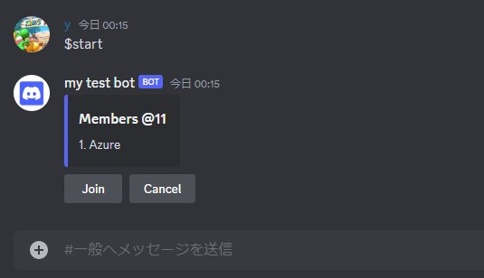
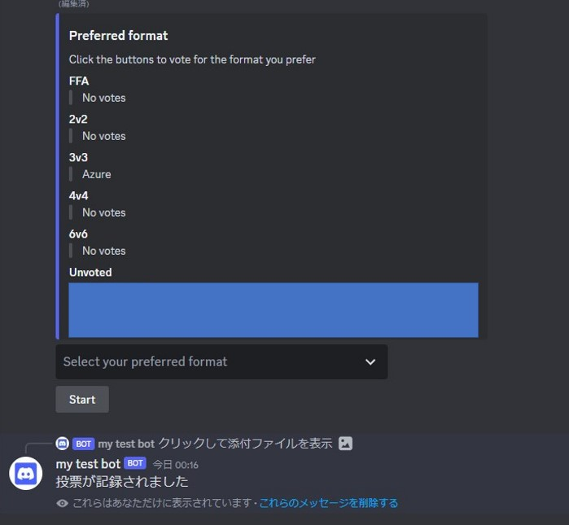
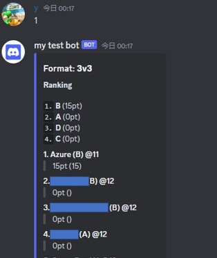
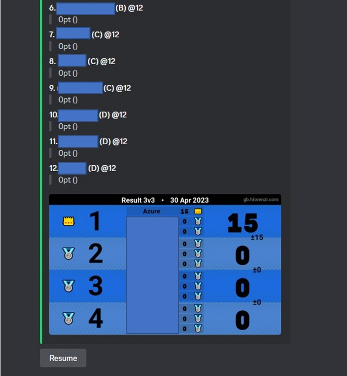

# Queue bot

## 概要

本Botは、マリオカートの模擬をサポートするためのDiscord Botです。具体的には以下の機能を提供します。

- 模擬に参加するメンバーの募集
- 模擬形式の投票
- プレイヤーのランダムなチーム分け
- 各レースごとの順位の登録、集計
- 集計画像の作成

## 使い方

以下ではBotの使い方を説明します。

### 模擬の募集

`$start`コマンドで模擬の募集を開始します。このコマンドを実行すると、模擬に参加するメンバーを募集するためのメッセージが送信されます。「Join」ボタンを押すことでで参加できます。



### 模擬形式の投票

メンバーが12人集まると、Botが模擬形式の投票を開始します。デフォルトでは12人の投票が終了すると模擬が開始されますが、「Start」ボタンを押すことで投票を終了し、模擬を開始することができます。（同数の場合はそのうちからランダムな形式が選ばれます。）



### 模擬の実施

模擬が開始されると、各レースごとに順位を登録することができます。各プレイヤーはレースが終了するごとに順位を入力することで登録できます。全員が同じレースごとに登録する必要はなく、各自が自由なタイミングで12レース登録すればよいです。

例えば、以下のようにレース後に1と入力すると1位として登録されます。backと入力することで、直前の登録を取り消すこともできます。



### 集計画像の作成

全員が12レース登録すると、模擬の集計画像が作成されます。強制的に模擬を終了したい場合は「End」ボタンを押してください。再開する場合は「Resume」ボタンで再開できます。




## 扱うデータについて

本Botは、一時的にユーザー名を取得することはありますがdiscord上で全て完結しており、データを保存することは一切ありません。


## ライセンス

本BotはMITライセンスのもとで公開されています。詳細は[LICENSE](LICENSE)を参照してください。


## Botのセットアップ

環境変数に


```env

BOT_TOKEN = DiscordのBotのトークン
LOG_CHANNEL_ID = ログを送信するチャンネルのID

```

として登録すれば動きます。

```bash
pip install -r requirements.txt
```

として必要なライブラリをインストールしてください。(py-cordのみ)

srcフォルダ内のbot.pyを実行することでBotが起動します。